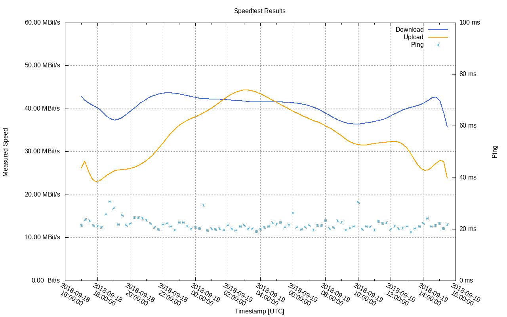

# speedtest logger

This is a Docker container with the tool
[speedtest-cli](https://github.com/sivel/speedtest-cli) inside, which
uses a crontab to log speedtest results in csv format every 15 minutes.

## installation

Obviously, you need to have Docker installed to run the container. Refer
to your distribution or [the Docker docs](https://docs.docker.com/install/)
on how to do that. You can also [take measurements](#direct-speedtest-cli-usage)
without using the Docker container if you have `speedtest-cli` installed.

From within this directory you can use the makefile to build the image and
run it. This requires [make](https://www.gnu.org/software/make/), of course.
Take a look inside the [makefile](makefile) to see what the targets do.

In order to plot the results [gnuplot](http://gnuplot.sourceforge.net) is
required. Alternatively open the `result.csv` with any tabular calculation
program like Microsoft Excel or LibeOffice Calc.

## usage

See help on available makefile targets:

    make help

### build and run the image

Build the Docker image:

    make image

Run the image in the background:

    make run

You can specify an alternative schedule for the speedtests. If you want to
run tests every 5 minutes (default is 15) use:

    make run MINUTES=5

Or specify the [complete schedule](https://crontab.guru/) directly, e.g.
"four times a day":

    make run SCHEDULE="0 */6 * * *"

### export results

Check / export the logs after a while. The results are formatted as CSV and
are output to stdout:

    make logs

When you have collected enough results you can stop the container:

    make stop

Then export the results to `results.csv` and plot them with `gnuplot`:

    make csv
    make plot
    xdg-open results.png

To apply different smoothing functions for the plot, use `SMOOTH`. See the
[gnuplot manual](http://gnuplot.info/docs_5.2/Gnuplot_5.2.pdf#section*.174)
for possible options. For a greater number of measurements, `bezier` might
be useful:

    make plot SMOOTH=bezier

### direct speedtest-cli usage

You can also use a simple and naiive `sleep`-loop to collect measurements
without using the Docker container at all:

    make direct MINUTES=5

This will run a simple loop which sleeps for MINUTES * 60 seconds between
measurements. To be useful, you'll need to let this command run for a couple
of hours, thus I suggest you use [tmux](https://github.com/tmux/tmux) or
[screen](https://www.gnu.org/software/screen/) to detach your tty while it does.

You can also use any other other method to build your `results.csv`, it just
needs to conform to the expected format with a header and one measurement per
line. Afterwards plot the image as shown above:

    make plot

### cleanup

Afterwards you can remove the container and clean the result files when they
are not needed anymore:

    make remove
    make clean

## license

Copyright (c) 2018 Anton Semjonov
Licensed under the MIT License
